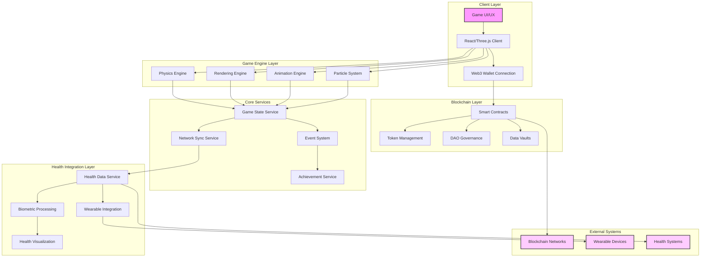
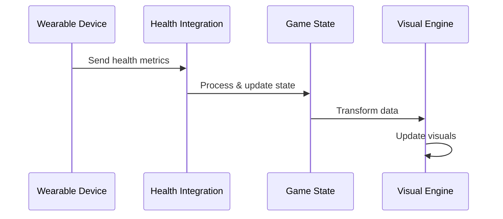
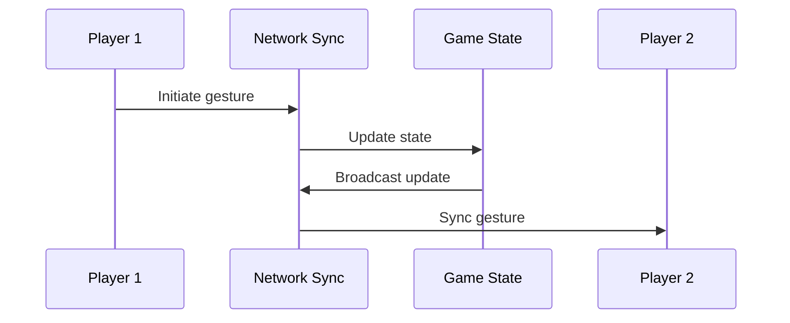
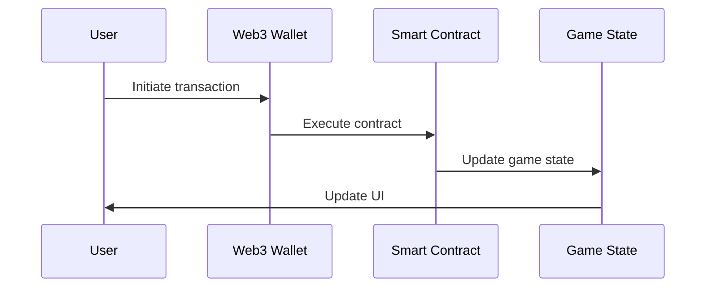
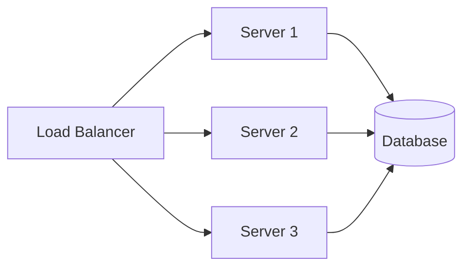
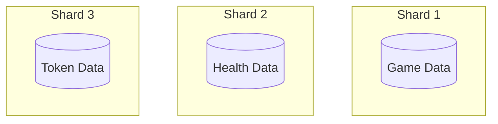

# Holistic Health Journey - Technical Architecture

## System Overview Diagram

## Component Details

### Client Layer
- **Game UI/UX**: React-based user interface with Three.js for 3D rendering
- **React/Three.js Client**: Main game client handling rendering and user input
- **Web3 Wallet Connection**: Integration with MetaMask and other Web3 wallets

### Game Engine Layer
- **Physics Engine**: Handles movement, collisions, and environmental interactions
- **Rendering Engine**: Three.js-based rendering system for game visuals
- **Animation Engine**: Manages character and environmental animations
- **Particle System**: Handles visual effects for auras, energy, and interactions

### Core Services
- **Game State Service**: Central state management using Redux/MobX
- **Network Sync Service**: Real-time multiplayer synchronization
- **Event System**: Handles game events, achievements, and interactions
- **Achievement Service**: Tracks and manages player/community achievements

### Health Integration Layer
- **Health Data Service**: Central health data processing and management
- **Wearable Integration**: Connects with various health tracking devices
- **Biometric Processing**: Processes and analyzes health metrics
- **Health Visualization**: Transforms health data into visual elements

### Blockchain Layer
- **Smart Contracts**: Manages tokens, governance, and data ownership
- **Token Management**: Handles $HLTH tokens and SBTs
- **DAO Governance**: Implements community governance mechanisms
- **Data Vaults**: Secure storage for sensitive health data

### External Systems
- **Blockchain Networks**: Connection to Ethereum/other chains
- **Wearable Devices**: Integration with health tracking devices
- **Health Systems**: Connection to external health data providers

## Data Flow Examples

### Health Data Flow

### Player Interaction Flow

### Token Transaction Flow

## Scaling Considerations

### Horizontal Scaling

### Data Sharding

This architecture emphasizes:
1. Modular design for easy scaling
2. Clear separation of concerns
3. Secure health data handling
4. Real-time game state management
5. Efficient blockchain integration
6. Scalable multiplayer support
