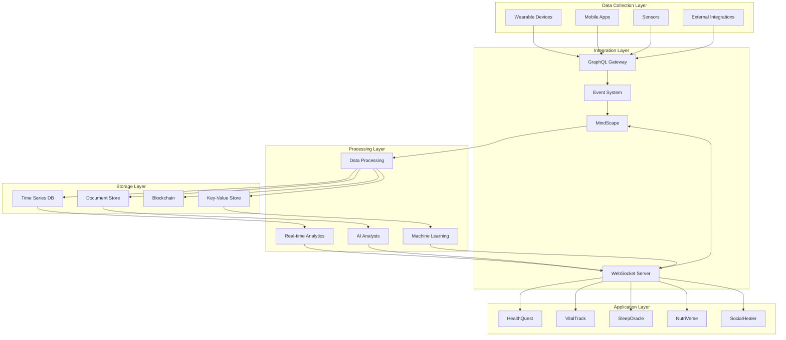
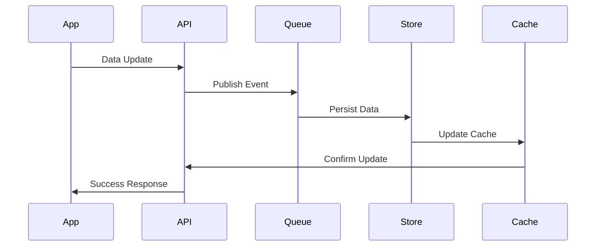
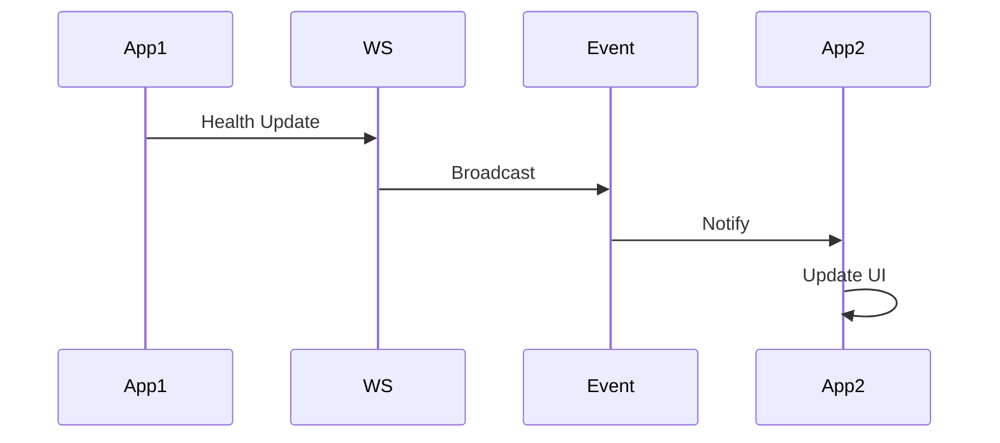
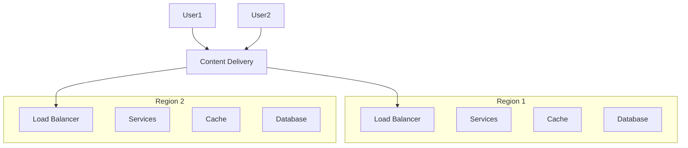

# Holistic Health Ecosystem - Integration Architecture & Roadmap

## 1. Core Integration Architecture

### 1.1 Central Integration Hub
- **HealthAPI Gateway**
  * GraphQL API layer
  * Real-time WebSocket connections
  * Event-driven architecture
  * Microservices orchestration
  * Load balancing & scaling

### 1.2 Data Flow Architecture

## 2. Technical Stack

### 2.1 Backend Infrastructure
- **Core Services**
  * Node.js/TypeScript microservices
  * GraphQL API gateway
  * Redis for caching
  * Apache Kafka for event streaming
  * PostgreSQL for relational data
  * MongoDB for document storage
  * InfluxDB for time series
  * Ethereum for blockchain

### 2.2 Frontend Framework
- **Cross-platform Development**
  * React Native for mobile
  * React.js for web
  * Three.js for 3D rendering
  * WebGL for graphics
  * PWA capabilities
  * Offline-first architecture

## 3. Integration Patterns

### 3.1 Data Synchronization

### 3.2 Real-time Updates

## 4. Development Roadmap

### Phase 1: Foundation (Months 1-3)
1. **Core Infrastructure**
   - Set up cloud infrastructure
   - Implement API gateway
   - Create base microservices
   - Establish data stores

2. **Basic Integration**
   - Health data collection
   - Real-time sync system
   - Basic authentication
   - Initial API endpoints

### Phase 2: Core Apps (Months 4-6)
1. **VitalTrack Development**
   - Health data processing
   - Analytics engine
   - Dashboard creation
   - Device integration

2. **HealthQuest Basics**
   - Game engine setup
   - Basic mechanics
   - Data visualization
   - Avatar system

### Phase 3: Expansion (Months 7-9)
1. **Wellness Suite**
   - MindScape integration
   - SleepOracle development
   - NutriVerse implementation
   - Cross-app communication

2. **Community Features**
   - Social networking
   - Group activities
   - Event system
   - Messaging platform

### Phase 4: Advanced Features (Months 10-12)
1. **Blockchain Integration**
   - Smart contracts
   - Token system
   - Data marketplace
   - Value exchange

2. **AI & Analytics**
   - Pattern recognition
   - Predictive modeling
   - Recommendation engine
   - Insights generation

### Phase 5: Professional Tools (Months 13-15)
1. **Practitioner Platform**
   - Patient management
   - Treatment tracking
   - Integration tools
   - Professional dashboard

2. **Research Platform**
   - Study management
   - Data analysis
   - Pattern recognition
   - Knowledge sharing

## 5. Integration Milestones

### 5.1 Technical Milestones
1. **M1: Core Infrastructure**
   - API gateway operational
   - Basic data flow established
   - Authentication system
   - Initial storage solution

2. **M2: Real-time System**
   - WebSocket implementation
   - Event system operational
   - Real-time updates
   - Data synchronization

3. **M3: Data Processing**
   - Analytics pipeline
   - Machine learning system
   - Pattern recognition
   - Predictive modeling

4. **M4: Blockchain**
   - Smart contracts
   - Token system
   - Data marketplace
   - Value exchange

### 5.2 Application Milestones
1. **M1: Basic Apps**
   - VitalTrack beta
   - HealthQuest prototype
   - Cross-app authentication
   - Basic integration

2. **M2: Extended Features**
   - Wellness suite
   - Community features
   - Social integration
   - Advanced gameplay

3. **M3: Professional Tools**
   - Practitioner platform
   - Research tools
   - Advanced analytics
   - Full integration

## 6. Scaling Strategy

### 6.1 Infrastructure Scaling

### 6.2 Data Scaling
- **Sharding Strategy**
  * Geographic sharding
  * User-based sharding
  * Time-based partitioning
  * Hot/cold data separation

## 7. Monitoring & Maintenance

### 7.1 System Health
- **Metrics Collection**
  * Service health
  * Performance metrics
  * Error tracking
  * Usage statistics

### 7.2 User Experience
- **Analytics**
  * User engagement
  * Feature usage
  * Performance metrics
  * Error tracking
