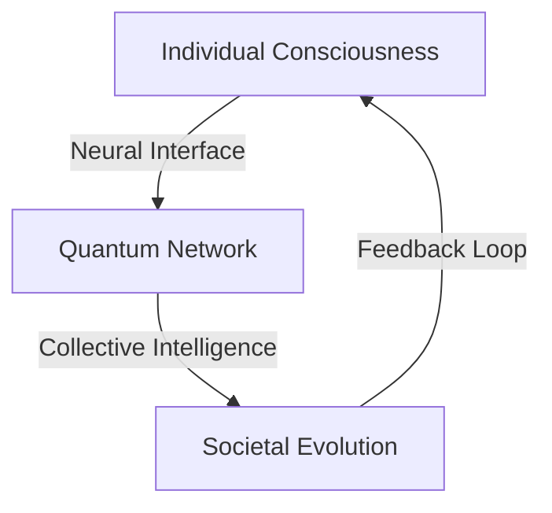

# Quantum Society: A Neural Network for Human Evolution
## Vision Paper 2024

## Executive Summary
Quantum Society is not just a game—it's a living, breathing neural network that connects human consciousness, biological data, and societal structures into a revolutionary platform for human evolution. By merging quantum computing, biotech, augmented reality, and social dynamics, we create a new paradigm for human health, consciousness, and collective growth.

## 1. The Meta Crisis

### 1.1 Current Challenges
- Mental health epidemic
- Social disconnection
- Environmental degradation
- Loss of meaning and purpose
- Technological addiction
- Wealth inequality
- Health system collapse

### 1.2 Root Cause Analysis
The fundamental issue isn't individual problems, but rather our fragmented approach to solving them. We're treating symptoms while ignoring the interconnected nature of human existence.

## 2. The Quantum Solution

### 2.1 Core Concept
Quantum Society creates a living, breathing digital-biological network that:
- Maps human consciousness patterns
- Tracks collective emotional states
- Measures societal health metrics
- Facilitates consciousness evolution
- Enables collective problem-solving
- Catalyzes human potential

### 2.2 Key Innovations

#### Quantum Consciousness Interface


1. **Neural Mapping**
   - Brain-computer interfaces
   - Emotional state tracking
   - Consciousness pattern recognition
   - Quantum coherence measurement

2. **Collective Intelligence**
   - Group consciousness dynamics
   - Emergent problem-solving
   - Shared emotional fields
   - Evolutionary algorithms

## 3. Game Mechanics

### 3.1 Personal Evolution
1. **Consciousness Levels**
   - Awareness tracking
   - Emotional intelligence
   - Mental clarity
   - Spiritual connection

2. **Bio-Feedback**
   - Real-time health metrics
   - Energy field measurement
   - DNA expression tracking
   - Quantum coherence scores

3. **Growth Paths**
   - Consciousness evolution
   - Skill development
   - Social impact
   - Environmental harmony

### 3.2 Collective Dynamics

1. **Group Resonance**
   - Collective emotional states
   - Group consciousness fields
   - Shared intentions
   - Social coherence

2. **Impact Waves**
   - Ripple effects of actions
   - Collective field influences
   - Evolutionary pressure
   - Social transformation

## 4. Technical Architecture

### 4.1 Quantum Core
```python
class QuantumNetwork:
    def __init__(self):
        self.consciousness_field = QuantumField()
        self.collective_intelligence = EmergentSystem()
        self.evolution_engine = QuantumEvolution()

    def process_consciousness(self, individual_state):
        # Process individual consciousness
        # Integrate with collective field
        # Generate evolutionary pressure
        return evolved_state
```

### 4.2 Neural Interface
- Direct brain connection
- Emotional field sensors
- Quantum state readers
- Consciousness monitors

### 4.3 Biological Integration
- DNA tracking
- Epigenetic monitoring
- Cellular health metrics
- Energy field measurement

## 5. Evolution Mechanics

### 5.1 Individual Evolution
1. **Consciousness Growth**
   - Awareness expansion
   - Emotional mastery
   - Mental development
   - Spiritual connection

2. **Biological Optimization**
   - DNA expression
   - Cellular health
   - Energy coherence
   - Physical vitality

3. **Social Development**
   - Empathy expansion
   - Collective awareness
   - Impact potential
   - Leadership emergence

### 5.2 Collective Evolution
1. **Group Consciousness**
   - Field coherence
   - Collective intelligence
   - Shared purpose
   - Evolutionary direction

2. **Societal Transformation**
   - Cultural evolution
   - System optimization
   - Resource distribution
   - Environmental harmony

## 6. Impact Mechanics

### 6.1 Personal Impact
1. **Health Transformation**
   - Mental clarity
   - Emotional balance
   - Physical vitality
   - Spiritual connection

2. **Consciousness Evolution**
   - Awareness expansion
   - Reality perception
   - Purpose alignment
   - Potential activation

### 6.2 Collective Impact
1. **Social Transformation**
   - Cultural evolution
   - System optimization
   - Resource distribution
   - Environmental harmony

2. **Species Evolution**
   - Consciousness expansion
   - Biological optimization
   - Social coherence
   - Evolutionary leaps

## 7. Implementation Path

### 7.1 Phase 1: Foundation
1. **Neural Interface**
   - Basic brain connection
   - Emotional tracking
   - Consciousness mapping
   - Field measurement

2. **Quantum Network**
   - Individual processing
   - Basic collective fields
   - Evolution tracking
   - Impact measurement

### 7.2 Phase 2: Evolution
1. **Advanced Features**
   - Deep consciousness mapping
   - Complex field dynamics
   - Evolutionary algorithms
   - Reality manipulation

2. **Collective Systems**
   - Group consciousness
   - Societal transformation
   - Species evolution
   - Universal connection

## 8. Societal Integration

### 8.1 Health System
- Mental health revolution
- Emotional healing
- Physical optimization
- Consciousness medicine

### 8.2 Education System
- Consciousness development
- Potential activation
- Purpose discovery
- Evolution acceleration

### 8.3 Social System
- Cultural transformation
- Resource optimization
- Environmental harmony
- Collective evolution

## 9. Future Vision

### 9.1 Near Future (5 years)
- Basic neural interface
- Simple collective fields
- Initial evolution tracking
- Local impact measurement

### 9.2 Mid Future (10 years)
- Advanced consciousness mapping
- Complex field dynamics
- Evolutionary algorithms
- Global transformation

### 9.3 Far Future (25+ years)
- Complete consciousness integration
- Universal field connection
- Species evolution
- Reality transformation

## 10. Ethical Considerations

### 10.1 Individual Rights
- Consciousness sovereignty
- Data ownership
- Evolution choice
- Impact control

### 10.2 Collective Responsibility
- Field influence
- Evolution direction
- Resource distribution
- Environmental impact

## 11. Risk Management

### 11.1 Technical Risks
- Interface stability
- Field coherence
- Evolution control
- System security

### 11.2 Consciousness Risks
- Evolution speed
- Reality perception
- Field influence
- Power dynamics

## 12. Success Metrics

### 12.1 Individual Metrics
- Consciousness growth
- Health optimization
- Purpose alignment
- Impact potential

### 12.2 Collective Metrics
- Field coherence
- Social transformation
- Resource optimization
- Species evolution

## Conclusion
Quantum Society represents a paradigm shift in human evolution, offering a path to transform both individual consciousness and collective reality. Through the integration of cutting-edge technology with ancient wisdom, we create a platform for the next step in human development.
