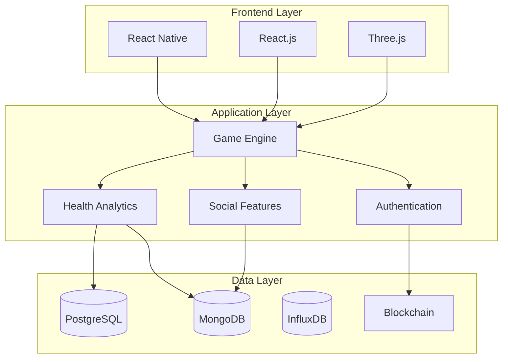
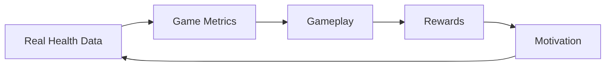

# Holistic Health Journey: A Revolutionary Health-Gaming Platform
## White Paper v1.0

## Executive Summary
Holistic Health Journey (HHJ) is a groundbreaking platform that transforms personal health management into an immersive, gamified experience. By combining cutting-edge technology with ancient wisdom, HHJ creates a unique ecosystem where real-world health metrics directly influence gameplay, creating a powerful feedback loop for wellness optimization.

## 1. Vision & Philosophy

### 1.1 Core Vision
To create a revolutionary platform where personal health improvement becomes an engaging journey of discovery, combining the appeal of gaming with tangible health benefits.

### 1.2 Philosophical Foundation
- **Holistic Integration**: Unifying physical, mental, emotional, and spiritual health
- **Gamified Motivation**: Leveraging game psychology for health engagement
- **Community Wisdom**: Harnessing collective knowledge for individual growth
- **Data Sovereignty**: Ensuring user control over personal health data

## 2. Technical Architecture

### 2.1 Core Technology Stack


### 2.2 Key Components
1. **Game Engine**
   - Three.js for 3D rendering
   - WebGL for graphics
   - Physics engine for movement
   - Real-time state management

2. **Health Analytics**
   - Machine learning models
   - Pattern recognition
   - Predictive analytics
   - Real-time processing

3. **Data Management**
   - Blockchain for security
   - Distributed storage
   - Real-time synchronization
   - Privacy protection

## 3. Game Mechanics

### 3.1 Core Gameplay Loop


### 3.2 Health-Game Mapping
1. **Vital Energy System**
   - HRV → Movement speed
   - Sleep quality → Power regeneration
   - Physical activity → Action range

2. **Mental System**
   - Meditation → Time control
   - Focus scores → Precision
   - Stress levels → Special abilities

3. **Social System**
   - Community interaction → Group buffs
   - Support networks → Healing power
   - Knowledge sharing → Skill unlocks

## 4. Implementation Roadmap

### 4.1 Phase 1: Foundation (Months 1-3)
1. **Week 1-2: Project Setup**
   - Development environment
   - CI/CD pipeline
   - Basic architecture

2. **Week 3-4: Core Systems**
   - Authentication
   - Database setup
   - Basic API structure

3. **Week 5-8: Basic Game Engine**
   - 3D rendering setup
   - Basic movement
   - Camera controls

4. **Week 9-12: Health Integration**
   - Health data collection
   - Basic analytics
   - Data visualization

### 4.2 Phase 2: Core Features (Months 4-6)
1. **Week 13-16: Game Mechanics**
   - Avatar system
   - Basic gameplay
   - Health mapping

2. **Week 17-20: Health Features**
   - Wearable integration
   - Health tracking
   - Analytics dashboard

3. **Week 21-24: Social Features**
   - Basic profiles
   - Community features
   - Activity sharing

### 4.3 Phase 3: Advanced Features (Months 7-9)
1. **Week 25-28: Advanced Gameplay**
   - Complex mechanics
   - Achievement system
   - Reward mechanics

2. **Week 29-32: Advanced Health**
   - AI analysis
   - Pattern recognition
   - Predictive features

3. **Week 33-36: Community**
   - Group activities
   - Social challenges
   - Knowledge sharing

### 4.4 Phase 4: Polish & Scale (Months 10-12)
1. **Week 37-40: Performance**
   - Optimization
   - Load testing
   - Scaling solutions

2. **Week 41-44: Security**
   - Audit
   - Penetration testing
   - Privacy enhancements

3. **Week 45-48: Launch Prep**
   - Beta testing
   - Bug fixes
   - Documentation

## 5. Technical Specifications

### 5.1 Frontend Requirements
- React Native for mobile
- React.js for web
- Three.js for 3D
- WebGL for graphics
- PWA capabilities

### 5.2 Backend Requirements
- Node.js/TypeScript
- GraphQL API
- WebSocket support
- Microservices architecture

### 5.3 Database Requirements
- PostgreSQL for relational data
- MongoDB for documents
- InfluxDB for time series
- Redis for caching

### 5.4 Infrastructure Requirements
- AWS/GCP hosting
- Docker containerization
- Kubernetes orchestration
- CDN integration

## 6. Development Workflow

### 6.1 Sprint Structure


### 6.2 Quality Assurance
1. **Automated Testing**
   - Unit tests
   - Integration tests
   - E2E tests
   - Performance tests

2. **Manual Testing**
   - Gameplay testing
   - UX testing
   - Health tracking validation
   - Security testing

## 7. Security & Privacy

### 7.1 Data Protection
- End-to-end encryption
- Zero-knowledge proofs
- Granular permissions
- Audit logging

### 7.2 Compliance
- HIPAA compliance
- GDPR compliance
- Data sovereignty
- Privacy by design

## 8. Monetization Strategy

### 8.1 Revenue Streams
1. **Premium Features**
   - Advanced analytics
   - Special game content
   - Professional tools

2. **Marketplace**
   - Health data exchange
   - Professional services
   - Digital assets

### 8.2 Token Economics
- Utility token for ecosystem
- Rewards for participation
- Governance rights
- Value accrual model

## 9. Success Metrics

### 9.1 Key Performance Indicators
1. **User Engagement**
   - Daily active users
   - Session duration
   - Feature usage
   - Retention rates

2. **Health Impact**
   - Health improvements
   - Behavior changes
   - Community growth
   - Knowledge sharing

3. **Technical Performance**
   - Response times
   - System uptime
   - Error rates
   - Scale efficiency

## 10. Future Expansion

### 10.1 Planned Features
1. **Advanced AI**
   - Personalized recommendations
   - Advanced pattern recognition
   - Predictive health modeling

2. **Extended Reality**
   - VR support
   - AR features
   - Mixed reality experiences

3. **Research Platform**
   - Health studies
   - Data analysis
   - Knowledge generation

### 10.2 Ecosystem Growth
1. **Platform Expansion**
   - Additional integrations
   - New health metrics
   - Extended gameplay

2. **Community Development**
   - Governance system
   - Knowledge base
   - Expert network

## 11. Risk Mitigation

### 11.1 Technical Risks
- Performance optimization
- Scalability challenges
- Integration complexity
- Security threats

### 11.2 Market Risks
- User adoption
- Competition
- Regulatory changes
- Technology evolution

## 12. Conclusion
Holistic Health Journey represents a paradigm shift in health management, combining cutting-edge technology with gamification to create an engaging and effective platform for personal wellness. Through careful implementation and continuous iteration, we aim to create a revolutionary product that transforms how people approach their health journey.

## 13. Skills & Community Collaboration System

### 13.1 Skill Ecosystem
1. **Skill Categories**
   - **Tangible Skills**
     * Professional certifications
     * Technical abilities
     * Practical crafts
     * Physical training expertise
   - **Intangible Skills**
     * Emotional intelligence
     * Energy healing
     * Meditation guidance
     * Spiritual practices
   - **Community Skills**
     * Teaching/mentoring
     * Event organization
     * Community building
     * Conflict resolution

### 13.2 Skill Verification System


1. **Validation Methods**
   - Peer endorsements
   - Project completion records
   - Community feedback
   - Real-world impact metrics

2. **Trust System**
   - Reputation scoring
   - Success stories
   - Community testimonials
   - Impact tracking

### 13.3 Community Collaboration Features

1. **Project Matching**
   - Skill-based project recommendations
   - Community needs matching
   - Collaborative opportunities
   - Resource sharing initiatives

2. **Knowledge Exchange**
   - Skill-sharing workshops
   - Mentorship programs
   - Community classes
   - Collaborative learning

3. **Impact Tracking**
   - Community contribution metrics
   - Skill utilization analytics
   - Social impact measurement
   - Growth tracking

### 13.4 Gamification of Skills

1. **Skill Progression System**
   - Experience points from real activities
   - Skill tree advancement
   - Mastery levels
   - Specialization paths

2. **Achievement System**
   - Real-world mission completion
   - Community impact badges
   - Collaboration rewards
   - Teaching achievements

3. **Collaborative Challenges**
   - Group skill quests
   - Community projects
   - Team achievements
   - Impact missions

### 13.5 Integration with Health Journey

1. **Holistic Growth Mapping**
   - Skill impact on well-being
   - Community health contributions
   - Personal growth metrics
   - Social wellness indicators

2. **Balanced Development**
   - Mind-body-spirit alignment
   - Social health integration
   - Community wellness impact
   - Personal mastery journey

### 13.6 Skill Marketplace

1. **Exchange Platform**
   - Skill trading system
   - Time banking
   - Resource sharing
   - Project collaboration

2. **Community Projects**
   - Local initiatives
   - Global collaborations
   - Impact projects
   - Wellness programs

3. **Value Creation**
   - Community currency
   - Skill tokens
   - Impact rewards
   - Growth incentives

### 13.7 Privacy & Trust

1. **Skill Verification**
   - Decentralized validation
   - Community consensus
   - Achievement proof
   - Impact verification

2. **Data Protection**
   - Selective sharing
   - Privacy controls
   - Consent management
   - Information rights

### 13.8 Technical Implementation

1. **Skill Graph Database**
   - Neo4j for skill relationships
   - GraphQL API
   - Real-time updates
   - Complex queries

2. **Matching Algorithm**
   ```python
   class SkillMatcher:
       def match_skills(user_skills, project_needs):
           return {
               'direct_matches': find_direct_matches(),
               'complementary_skills': find_complementary(),
               'learning_opportunities': find_growth_paths()
           }
   ```

3. **Trust Protocol**
   ```python
   class TrustSystem:
       def calculate_trust_score(user):
           return {
               'peer_endorsements': weight_endorsements(),
               'impact_score': calculate_impact(),
               'community_rating': aggregate_ratings()
           }
   ```

### 13.9 User Experience

1. **Skill Profile**
   - Visual skill map
   - Growth timeline
   - Impact dashboard
   - Community connections

2. **Discovery Interface**
   - Project discovery
   - Skill matching
   - Learning opportunities
   - Collaboration suggestions

3. **Progress Tracking**
   - Skill development metrics
   - Impact visualization
   - Community contribution
   - Growth analytics
